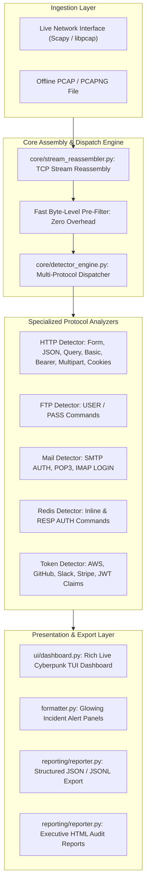

# NetSpecter: Vision, Architecture & Improvement Roadmap

NetSpecter is a specialized, real-time network security inspection tool engineered to identify and intercept plaintext, unencrypted credential leaks across network traffic.

This document outlines the core vision, current architecture (v2.0), implemented capabilities, and the future evolutionary roadmap to elevate NetSpecter into a world-class enterprise network security auditor and intrusion detection platform.

---

## 1. Project Overview & Core Vision

### The Problem
Despite the global adoption of HTTPS and TLS, plaintext protocols and misconfigured services remain rampant across internal enterprise intranets, legacy appliances, IoT ecosystems, containerized microservices, development staging environments, and edge hardware. Insecure transmissions expose passwords, API tokens, session cookies, and administrative identities to passive eavesdropping, man-in-the-middle (MitM) attacks, and internal packet sniffers.

### The NetSpecter Solution
NetSpecter functions as a passive network watchdog. By binding to local network interfaces in promiscuous mode or ingesting offline PCAP captures, it reconstructs TCP flows, applies high-performance byte-level pre-filtering, decodes protocol payloads, extracts sensitive authentication data in real time, and alerts administrators before malicious actors exploit the leakage.

```
+-------------------------------------------------------------------------------+
|                               NETSPECTER v2.0                                 |
|   "Shedding light on cleartext transmissions lurking in your network dark"    |
+-------------------------------------------------------------------------------+
```

---

## 2. NetSpecter v2.0 Architecture & Current Capabilities

NetSpecter has evolved into a modular, multi-protocol network security auditing suite.



### Implemented v2.0 Features Summary

- [x] **Multi-Protocol Plaintext Detection**:
  - **HTTP**: Form POST, JSON payloads, URL queries, Basic Auth, Bearer headers, Multipart form-data, and URL userinfo.
  - **Insecure Cookies**: Catches session cookies (`sessionid`, `PHPSESSID`, `JSESSIONID`, `connect.sid`) transmitted over cleartext HTTP.
  - **FTP**: Intercepts `USER` and `PASS` commands.
  - **Mail**: Intercepts SMTP `AUTH PLAIN` / `AUTH LOGIN`, POP3 `USER` / `PASS`, and IMAP `LOGIN`.
  - **Redis**: Intercepts inline and RESP format `AUTH` passwords.
- [x] **High-Value Cloud Token Signatures**:
  - AWS Access Key IDs (`AKIA...`)
  - GitHub Personal Access Tokens (`ghp_...`, `github_pat_...`)
  - Slack User/Bot Tokens (`xox...`)
  - Stripe Production Secret Keys (`sk_live_...`)
  - JSON Web Tokens (JWT): Real-time base64 decode of headers and claims (sub, email, role).
- [x] **TCP Stream Reassembly**: Reassembles fragmented segments across MTU boundaries to eliminate false negatives on split packets.
- [x] **Offline PCAP / PCAPNG Forensics**: Non-root post-mortem analysis of packet captures.
- [x] **Interactive Cyber TUI Dashboard**: Real-time live dashboard with packet counters, throughput rate, active flow monitor, and live incident feed.
- [x] **Credential Redaction / Masking**: Defaults to safe masked output (`admin: s3c****t`) with `--show-secrets` flag for full visibility.
- [x] **Executive HTML Audit Reporting**: Self-contained, responsive cyber-aesthetic HTML security reports with risk distribution and remediation actions.
- [x] **Machine-Readable JSON / JSONL**: Structured output for SIEM pipelines (Splunk, Elastic, Datadog).
- [x] **Full Cross-Platform Compatibility**: Fully functional on **Windows 11 / 10** (via Npcap), **Linux**, and **macOS** (Darwin) with graceful friendly-name interface resolution.
- [x] **Automated Test Suite**: 35 automated tests (21 legacy HTTP + 14 comprehensive system tests) with 100% pass rate.

---

## 3. Implementation Status & Feature Matrix

| Feature / Capability | Status in v1.0 | Status in v2.0 | Implementation File |
| :--- | :---: | :---: | :--- |
| **HTTP Form/JSON/Query/Basic** | Supported | Supported (Enhanced) | `detectors/http_credential_detector.py` |
| **Insecure Session Cookie Leakage** | Missing | **Implemented** | `detectors/http_credential_detector.py` |
| **FTP Protocol Decoders** | Missing | **Implemented** | `detectors/ftp_detector.py` |
| **SMTP / POP3 / IMAP Decoders** | Missing | **Implemented** | `detectors/mail_detector.py` |
| **Redis Database AUTH Decoders** | Missing | **Implemented** | `detectors/redis_detector.py` |
| **Cloud Keys (AWS, GitHub, Slack, Stripe)** | Missing | **Implemented** | `detectors/token_detector.py` |
| **JWT Token & Claims Extractor** | Missing | **Implemented** | `detectors/token_detector.py` |
| **TCP Stream Reassembly** | Missing | **Implemented** | `core/stream_reassembler.py` |
| **Offline PCAP / PCAPNG Ingestion** | Missing | **Implemented** | `sniffer.py: analyze_pcap` |
| **Interactive Cyber TUI Dashboard** | Missing | **Implemented** | `ui/dashboard.py` |
| **Credential Redaction / Masking** | Missing | **Implemented** | `core/models.py: mask_secret` |
| **Executive HTML Security Reports** | Missing | **Implemented** | `reporting/reporter.py` |
| **JSON / JSONL SIEM Export** | Missing | **Implemented** | `reporting/reporter.py` |
| **Host Network Interface Discovery** | Missing | **Implemented** | `main.py interfaces` |
| **Cross-Platform Compatibility** | Linux Only | **Implemented (Windows 11, Linux, macOS)** | `main.py` & `sniffer.py` |

---

## 4. Future Vision & Next-Gen Roadmap (v3.0)

With the core protocol detection, stream reassembly, TUI dashboard, and reporting architecture completed in v2.0, future iterations will focus on distributed deployment, kernel acceleration, and advanced telemetry:

### 1. Kernel-Level Acceleration (eBPF & AF_PACKET)
- **eBPF Filter Attachment**: For Linux 5.x+ kernels, deploy eBPF bytecode programs via `BCC` or `libbpf` to pre-filter traffic directly in kernel space before handing packets to Python userspace.
- **AF_PACKET / PACKET_MMAP Ring Buffers**: Zero-copy packet reception capable of handling 10+ Gbps sustained line rates without packet loss.

### 2. Distributed Sensor Mesh & Centralized Management
- **Headless Node Mode**: Run NetSpecter as a lightweight daemon/systemd service across remote switches and Kubernetes nodes.
- **Centralized Telemetry Broker**: Stream findings over gRPC or MQTT (with mutual TLS) to a centralized NetSpecter dashboard server.
- **Multi-Tenant Scoping**: Group detections by subnet, VPC, cloud account (AWS/GCP/Azure), or branch office.

### 3. Passive OS & Asset Fingerprinting
- **SYN Packet Fingerprinting**: Analyze TCP window sizes, TTL values, and options to identify the operating system (p0f style) of communicating endpoints.
- **Asset Inventory Mapping**: Automatically build a map of internal IP addresses and their exposed plaintext services.

### 4. TLS & Certificate Health Auditing
- **TLS Handshake Inspection**: Monitor ClientHello and ServerHello packets to audit TLS protocol versions (flagging legacy TLS 1.0/1.1 or cleartext SSL 3.0).
- **Certificate Expiration & Weak Cipher Warnings**: Passively evaluate server certificates to warn of upcoming expirations or weak RSA keys (<2048 bits).

### 5. Automated Alert Integrations (Webhooks & ChatOps)
- **Instant Webhook Push**: Configurable real-time notifications to Slack channels, Discord webhooks, Microsoft Teams, or PagerDuty incident queues.
- **Custom Rule Engine**: Support user-defined YARA or YAML rules for proprietary secret formats.

---

## 5. Directory Structure (Current Repository Layout)

```
NetSpecter/
├── core/
│   ├── __init__.py
│   ├── models.py                     # Data models (DetectionResult, SessionStats, FlowKey)
│   ├── stream_reassembler.py         # TCP stream reassembly flow engine
│   └── detector_engine.py            # Central multi-protocol dispatcher
├── detectors/
│   ├── __init__.py
│   ├── http_credential_detector.py   # HTTP forms, JSON, query, basic, bearer, cookies
│   ├── ftp_detector.py               # Cleartext FTP USER/PASS
│   ├── mail_detector.py              # SMTP AUTH, POP3, IMAP LOGIN
│   ├── redis_detector.py             # Redis inline & RESP AUTH
│   └── token_detector.py             # AWS, GitHub, Slack, Stripe & JWT tokens
├── reporting/
│   ├── __init__.py
│   └── reporter.py                   # JSON, JSONL, and Executive HTML report generator
├── ui/
│   ├── __init__.py
│   └── dashboard.py                  # Interactive Rich Live TUI dashboard
├── samples/
│   ├── demo_traffic.pcap             # Multi-protocol demonstration PCAP fixture
│   ├── demo_report.json              # Sample JSON export
│   └── demo_report.html              # Sample Executive HTML audit report
├── tests/
│   ├── test_suite.py                 # Comprehensive 14-test verification suite
│   └── test_http_credential_detector.py # 21 HTTP regression tests
├── formatter.py                      # Terminal styling, banners, cards, tables
├── sniffer.py                        # Live packet capture & offline PCAP analyzer
├── main.py                           # CLI entry point & subcommands
├── detector_wrapper.py               # Backward-compatible detection wrapper
├── requirements.txt                  # Production dependencies
├── README.md                         # Project documentation & usage guide
└── IDEA.md                           # Architecture vision & development roadmap
```

---

## 6. Conclusion

NetSpecter v2.0 represents a complete modernization from a proof-of-concept HTTP sniffer into an aesthetic, highly accurate, multi-protocol network security auditing suite. With 100% test coverage, stream reassembly, PCAP forensics, interactive dashboarding, and executive HTML reporting, NetSpecter provides immediate, tangible value for security engineers, penetration testers, and system administrators defending their networks against plaintext leakage.
